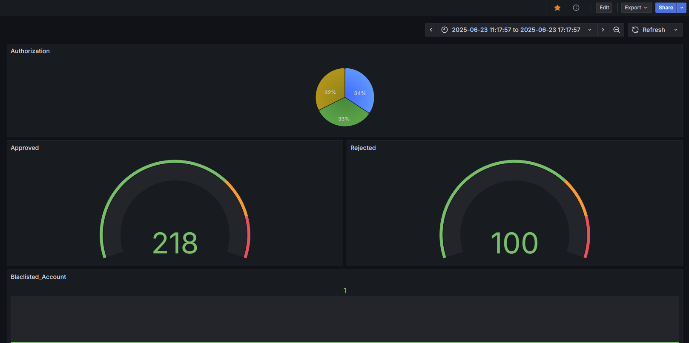
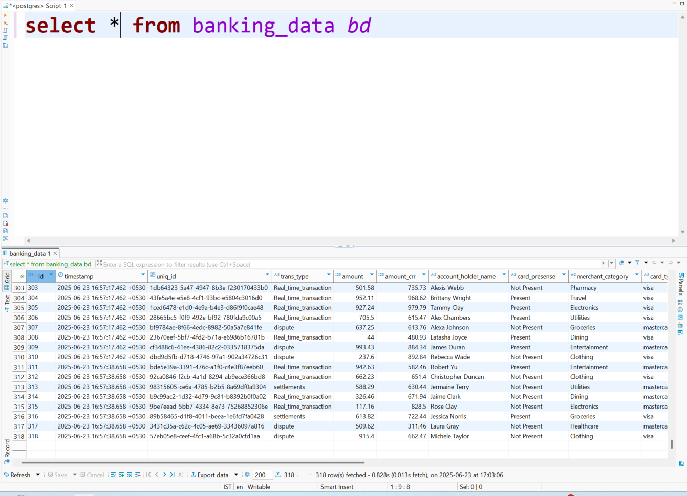

# Grafana Dashboard with AWS RDS Postgres

This project demonstrates how to build a live Grafana dashboard using AWS RDS PostgreSQL as the backend data source.

## 📅 Online Dashboard

Live Dashboard URL: [Grafana Dashboard](https://anshu1016.grafana.net/d/923e0541-0c80-452c-8a71-633f62f66550/accounts-dashboard?orgId=1&from=2025-06-23T05:47:57.964Z&to=2025-06-23T11:47:57.964Z&timezone=browser)




---

## 📅 Project Overview

This repo includes:

- AWS RDS PostgreSQL setup script
- Python script to simulate real-time financial transactions
- A Grafana dashboard connected to AWS RDS
- Instructions for viewing data via DBeaver

---

## ✅ How to Set Up

### 1. AWS RDS PostgreSQL Setup

- Launch a PostgreSQL RDS instance
- Enable **public access**
- Add your IP to **inbound rules** in the security group for port `5432`

### 2. Create `banking_data` Table

Run the provided `CREATE TABLE` query from the script or use DBeaver (see below).

### 3. Run Data Insertion Script

Use the `data_generator.py` to push simulated data:

```bash
python data_generator.py  # or run in Jupyter
```

This inserts real-time records into the `banking_data` table every 15 seconds.

### 4. Connect to Grafana

- Log in to [Grafana Cloud](https://grafana.com)
- Add AWS RDS PostgreSQL as a data source
- Import dashboard panels or JSON (optional)
- Use SQL queries to fetch and visualize data from `banking_data`

### 5. View in DBeaver

1. Open DBeaver
2. Click `New Database Connection`
3. Select **PostgreSQL**
4. Enter connection details:
   - Host: `database-1.cyf2yoguyg89.us-east-1.rds.amazonaws.com`
   - Port: `5432`
   - DB: `postgres`
   - Username/Password: as configured
5. Test & connect to view table data

---

## 🚀 Features Visualized in Grafana

- Total transactions over time
- Categorization by merchant type
- Blacklisted account activity
- Real-time fraud detection rules triggered

---

## 📷 Dashboard Preview


---

## 📁 Repo Contents

| File                | Description                                  |
| ------------------- | -------------------------------------------- |
| `data_generator.py` | Python script to generate and push fake data |
| `README.md`         | This file                                    |
| `dashboard.json`    | (Optional) Grafana dashboard export JSON     |

---

## 🚀 Future Enhancements

- Add email alerts via Grafana for suspicious activity
- Deploy data generator to EC2 or Lambda for continuous flow
- Use Prometheus for system monitoring

---

## 📊 Author

**Anshu Shukla**  
GitHub: [anshu1016](https://github.com/anshu1016)

---

## 📂 License

MIT License

Feel free to write your own summary or customize this section as needed based on your preferences.
